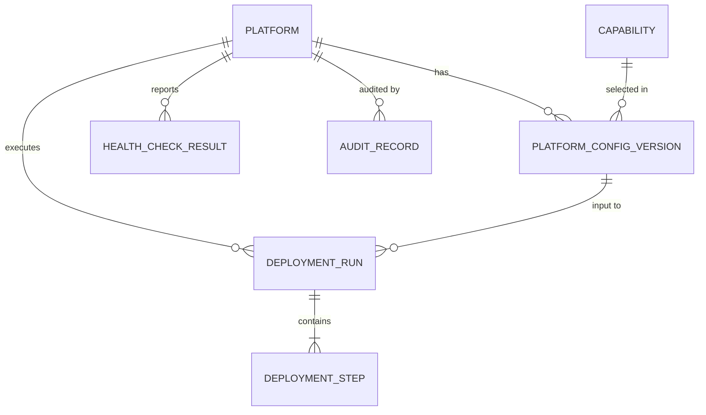

# Phase 1 Data Model: One-Click Platform Deployment

**Feature**: 001-one-click-platform-deployment | **Date**: 2026-09-13

Entities derived from the spec's Key Entities, refined with research decisions (see [research.md](./research.md)). Persistence: PostgreSQL via SQLAlchemy 2 + Alembic migrations.

## Entity Relationship Overview



---

## Platform

A deployed lakehouse environment.

| Field | Type | Constraints | Notes |
|---|---|---|---|
| id | UUID | PK | |
| name | string(63) | required, regex `^[a-z][a-z0-9-]{2,62}$` | user-facing name |
| provider | enum(`aws`,`gcp`) | required | FR-002 |
| cloud_scope_id | string | required | AWS account id / GCP project id |
| region | string | required | validated against provider region list |
| environment_type | enum(`development`,`test`,`uat`,`production`) | required | FR-010 |
| status | enum(`pending`,`deploying`,`ready`,`degraded`,`failed`,`destroying`,`destroyed`) | default `pending` | see state machine |
| owner_identity | string | required | federated IdP subject (assumption: cloud IAM federation) |
| current_config_version_id | UUID | FK → PlatformConfigVersion, nullable | last applied |
| created_at / updated_at | timestamptz | auto | |

**Uniqueness**: `(provider, cloud_scope_id, name)` — FR-013, R-12.
**Concurrency**: at most one run in `running`/`paused` per platform (DB partial unique index on DeploymentRun).

### Platform status state machine

```text
pending ──deploy──▶ deploying ──all health pass──▶ ready
                       │                              │
                       ├──health failures──▶ degraded │
                       ├──step failed──▶ failed       │
failed ──retry──▶ deploying                           │
failed ──rollback──▶ destroying ──▶ destroyed         │
ready/degraded ──config change──▶ deploying ──────────┘
ready/degraded ──destroy──▶ destroying ──▶ destroyed
```

---

## PlatformConfigVersion

An immutable, versioned snapshot of the declarative configuration (schema in [contracts/platform-config-schema.md](./contracts/platform-config-schema.md)).

| Field | Type | Constraints | Notes |
|---|---|---|---|
| id | UUID | PK | |
| platform_id | UUID | FK → Platform | nullable for not-yet-deployed drafts |
| version | int | ≥1, unique per platform | increments on change |
| config_yaml | text (YAML) | required | **no plaintext secrets** — `secretRef` only (SC-006); validated by secret-scan before persist |
| config_hash | string(64) | SHA-256 of canonical YAML | idempotency & drift detection |
| source | enum(`api`,`cli`,`git`) | required | GitOps provenance |
| git_ref | string | nullable | commit SHA when source=git |
| created_by | string | required | identity |
| created_at | timestamptz | auto | |

**Validation rules** (applied on create, FR-003, all errors returned at once):
1. Schema conformance (Pydantic model of the config contract).
2. Region supported by provider AND supports all selected capabilities (region-capability matrix).
3. Capability dependency closure: `semantic_layer → catalog`, `ingestion → storage_zones`, `quality → catalog`, `orchestration → compute`, all → `networking`, `iam`, `secrets`.
4. Production environment: `approval.ref` present, `encryption.*` settings explicit (FR-010).
5. Name matches platform naming rules; uniqueness pre-check (R-12).
6. No secret-like values (entropy + pattern scan) anywhere in the YAML (SC-006).

---

## DeploymentRun

A single execution of a deploy/update/destroy (FR-014, US1-AC3).

| Field | Type | Constraints | Notes |
|---|---|---|---|
| id | UUID | PK | run id shown to users |
| platform_id | UUID | FK → Platform | |
| config_version_id | UUID | FK → PlatformConfigVersion | exact input (SC-002) |
| run_type | enum(`deploy`,`update`,`retry`,`rollback`,`destroy`) | required | |
| status | enum(`queued`,`running`,`paused`,`succeeded`,`failed`,`rolled_back`) | default `queued` | |
| initiated_by | string | required | identity — audit |
| approval_ref | string | nullable | required when environment=production |
| started_at / finished_at | timestamptz | nullable | duration = finished − started (FR-014, FR-016) |
| terraform_workspace | string | unique per run | per-run state isolation (R-06) |
| failure_summary | text | nullable | top-level reason |

### Run status transitions

```text
queued ──worker picks up──▶ running ──all steps done──▶ succeeded
running ──step failed──▶ failed
failed ──retry-from-step──▶ running (same run, new attempt on step)
failed ──rollback requested──▶ running (rollback steps) ──▶ rolled_back
running ──credentials expired──▶ paused ──refresh+resume──▶ running
```

---

## DeploymentStep

Ordered unit of work within a run (FR-008; canonical order in R-11).

| Field | Type | Constraints | Notes |
|---|---|---|---|
| id | UUID | PK | |
| run_id | UUID | FK → DeploymentRun | |
| position | int | unique per run, 1-based | display order |
| key | string | e.g. `storage-zones`, `catalog`, `health-checks` | from capability registry / step catalog |
| capability | string | nullable | logical capability this step provisions |
| status | enum(`pending`,`running`,`succeeded`,`failed`,`skipped`) | default `pending` | `skipped` when capability disabled |
| attempt | int | default 0 | increments on retry |
| started_at / finished_at | timestamptz | nullable | |
| error_detail | text | nullable | human-readable failure reason (US1-AC3) |
| terraform_module | string | nullable | module path applied in this step |

---

## Capability

Logical platform function (registry-backed; mostly code-defined, persisted for auditability of what existed at deploy time).

| Field | Type | Constraints | Notes |
|---|---|---|---|
| key | string | PK, e.g. `catalog` | stable logical id |
| display_name | string | required | |
| depends_on | string[] | capability keys | dependency closure (validation rule 3) |
| selectable | bool | | `networking`/`iam`/`secrets`/`storage_zones` are mandatory core (not deselectable) |
| health_check | string | runner id | R-08 |
| module_template | string | per-provider path pattern `terraform/{provider}/{key}/` | R-02 |

MVP keys: `networking`, `storage_zones`, `iam`, `secrets`, `compute`, `orchestration`, `catalog`, `ingestion`, `quality`, `semantic_layer`, `monitoring`.

---

## EnvironmentType

Code-defined (no table); drives defaults and controls:

| Env | Approval required | Encryption settings | Sizing default | Notes |
|---|---|---|---|---|
| development | no | defaults allowed | small | |
| test | no | defaults allowed | small | |
| uat | no | explicit recommended | medium | |
| production | **yes** (approval_ref) | **mandatory explicit** | production | FR-010 stricter controls |

---

## HealthCheckResult

Per-component status feeding the dashboard (US3, FR-007).

| Field | Type | Constraints | Notes |
|---|---|---|---|
| id | UUID | PK | |
| platform_id | UUID | FK → Platform | |
| component | string | capability key or sub-component | |
| status | enum(`healthy`,`unhealthy`,`unknown`) | required | |
| last_check_at | timestamptz | required | US3-AC3 "last check time" |
| detail | text | nullable | failure reason |
| run_id | UUID | FK → DeploymentRun, nullable | set when produced during a run |

**Rule**: platform → `ready` only if all enabled capabilities' latest results are `healthy`; any `unhealthy` → `degraded` with the component flagged (US3-AC3).

---

## AuditRecord

Immutable append-only log (FR-014; constitution auditability).

| Field | Type | Constraints | Notes |
|---|---|---|---|
| id | UUID | PK | |
| platform_id | UUID | FK, nullable | null for global actions |
| actor | string | required | who |
| action | string | required | e.g. `deploy.requested`, `config.exported`, `rollback.executed`, `approval.granted` |
| occurred_at | timestamptz | required | when |
| payload | jsonb | required, secret-scanned | configuration snapshot / outcome / duration |

**Retention**: append-only; no UPDATE/DELETE granted to the application role.

---

## Cross-entity invariants

1. **No plaintext secrets** anywhere: `config_yaml`, `payload`, `error_detail`, logs — enforced by the secret-scan pass on every write path (SC-006).
2. **Reproducibility**: a Platform can always be recreated from its latest `PlatformConfigVersion.config_yaml` (SC-002); destroy + redeploy is a supported flow.
3. **One active run per platform** (spec assumption): partial unique index `WHERE status IN ('queued','running','paused')`.
4. **Encryption at rest from creation** (FR-017): storage/database modules take KMS key refs from the `secrets-kms` step; modules reject null encryption settings.
