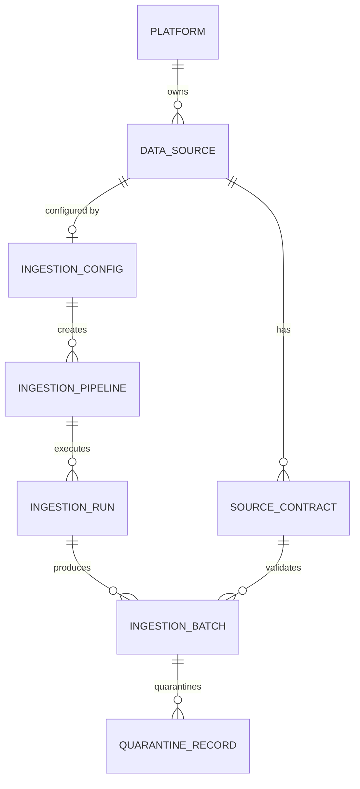

# Phase 1 Data Model: Self-Service Data Ingestion

**Feature**: 002-data-ingestion | **Date**: 2026-09-14

Entities derived from the spec's Key Entities, refined with research decisions (see [research.md](./research.md)). Persistence: the same PostgreSQL 15 as feature 001, via SQLAlchemy 2 + a new Alembic migration (reuses the JSONB variant, enums, and timezone conventions from `db/models.py`).

## Entity Relationship Overview



`PLATFORM` is the feature 001 `Platform` entity (a source/pipeline belongs to exactly one deployed platform).

---

## DataSource

A configured origin of data (spec Key Entity). Credentials are always a `secretRef` — never a value (FR-005, SC-007).

| Field | Type | Constraints | Notes |
|---|---|---|---|
| id | UUID | PK | |
| platform_id | UUID | FK → Platform | owning platform |
| name | string(63) | required, `^[a-z][a-z0-9-]{2,62}$` | unique per platform |
| type | enum(`postgres`,`sqlserver`,`object_storage`) | required | FR-001 source set |
| config_ref | jsonb | required, secret-scanned | host/database/port or location; `secretRef` for credentials |
| owner_identity | string(256) | required | |
| connection_state | enum(`untested`,`ok`,`failed`) | default `untested` | set by `test_connection` |
| last_test_at / last_test_detail | timestamptz / text | nullable | actionable error (auth vs network vs not-found) — US1-AC4 |
| created_at / updated_at | timestamptz | auto | |

**Uniqueness**: `(platform_id, name)`.
**Invariant**: no plaintext secrets anywhere in `config_ref` (secret-scan on write, SC-007).

---

## IngestionConfig

Per-source definition (spec Key Entity): selected tables/files, mode, cursor, schedule, target zone, validation settings. Declarative, version-controlled (FR-017), schema in [contracts/source-config-schema.md](./contracts/source-config-schema.md).

| Field | Type | Constraints | Notes |
|---|---|---|---|
| id | UUID | PK | |
| source_id | UUID | FK → DataSource | |
| version | int | ≥1, unique per source | increments on change |
| config_yaml | text | required, secret-scanned, no secrets | canonical YAML (FR-017) |
| config_hash | string(64) | SHA-256 | idempotency/drift |
| source_type | enum | matches source | |
| selected_objects | jsonb | required | tables (with cursor column) or file pattern |
| ingestion_mode | enum(`full`,`incremental`) | per-object | FR-003 |
| schedule | string | cron-like or interval | FR-011; null = manual only |
| target_zone | enum(`bronze`) | fixed for MVP | FR-018 |
| validation_settings | jsonb | reconciliation tolerance, contract mode | FR-009 |
| created_by / created_at | string / timestamptz | | |

**Validation rules** (all errors at once, mirrors feature 001 FR-003):
1. Schema conformance (Pydantic model of source-config-schema.md).
2. Selected tables/files exist for the source type; incremental objects have a cursor column.
3. Schedule string well-formed (interval/cron).
4. Secret-scan passes on `config_yaml`.

---

## SourceContract

The expected schema agreement for a source object (spec Key Entity). Columns, types, nullability; origin (`explicit` or `inferred`); approval status; classification rules (constitution IV, FR-010).

| Field | Type | Constraints | Notes |
|---|---|---|---|
| id | UUID | PK | |
| source_id | UUID | FK → DataSource | |
| object_name | string | table name or file pattern | one contract per source object |
| schema_definition | jsonb | required | `{column: {type, nullable}}` (contracts/source-contract-schema.md) |
| origin | enum(`explicit`,`inferred`) | required | |
| approval_status | enum(`pending`,`approved`,`rejected`) | default `pending` for inferred | never auto-approved (constitution V) |
| created_by / approved_by | string / string | nullable | |
| created_at / updated_at | timestamptz | auto | |

**Uniqueness**: `(source_id, object_name)`.
**Rule**: inferred contracts require explicit owner approval before they gate promotion (US3-AC3/AC4).

---

## IngestionPipeline

The executable unit created from an IngestionConfig (spec Key Entity).

| Field | Type | Constraints | Notes |
|---|---|---|---|
| id | UUID | PK | |
| config_id | UUID | FK → IngestionConfig | |
| source_id | UUID | FK → DataSource | |
| name | string(63) | required | display |
| state | enum(`active`,`paused`) | default `active` | FR-014 |
| schedule | string | nullable | copied from config; null = manual |
| owner_identity | string(256) | required | |
| high_watermarks | jsonb | `{object: cursor_value}` | R-06; advanced only on validated commit |
| created_at / updated_at | timestamptz | auto | |

**Concurrency**: at most one active `IngestionRun` per pipeline (partial unique index, R-10).

---

## IngestionBatch

One unit of ingested data (spec Key Entity). Status follows the promotion hand-off (constitution III).

| Field | Type | Constraints | Notes |
|---|---|---|---|
| id | UUID | PK | batch id |
| run_id | UUID | FK → IngestionRun | |
| pipeline_id | UUID | FK → IngestionPipeline | |
| source_object | string | table/file | FR-008 |
| source_system | string | source name | FR-008 |
| record_count | int | ≥0 | FR-008 |
| checksum | string(64) | nullable | file sources (FR-007) |
| status | enum(`ingesting`,`ingested`,`ingestion_validated`,`failed`,`quarantined`) | default `ingesting` | see state machine |
| ingested_at | timestamptz | | ingestion timestamp (FR-008) |
| metadata_json | jsonb | secret-scanned | full batch metadata (SC-003) |

**Status transitions**:

```text
ingesting ──landed──▶ ingested ──validation pass──▶ ingestion_validated
ingesting ──fatal──▶ failed
ingested  ──critical validation fail──▶ (stays ingested; NOT validated; alert raised)
any ──invalid payload routed──▶ quarantined (QuarantineRecord created)
```

**Rule**: a batch with a failing critical check is `ingested` but **never** `ingestion_validated` (blocks promotion; FR-009, SC-004).

---

## IngestionRun

One pipeline execution (spec Key Entity).

| Field | Type | Constraints | Notes |
|---|---|---|---|
| id | UUID | PK | run id |
| pipeline_id | UUID | FK → IngestionPipeline | |
| trigger | enum(`scheduled`,`manual`,`retry`) | required | FR-013 |
| status | enum(`queued`,`running`,`paused`,`succeeded`,`failed`) | default `queued` | |
| retry_of | UUID | nullable FK → IngestionRun | retry parent (FR-014) |
| started_at / finished_at | timestamptz | nullable | duration |
| records_processed | int | default 0 | FR-013 |
| outcome | enum(`success`,`partial`,`failed`) | nullable | partial = some objects quarantined/failed |
| failure_reason | text | nullable, redacted | FR-013, US1-AC4 |
| log_ref | string | nullable | structured log reference (FR-013) |

**Serialisation**: partial unique index `WHERE status IN ('queued','running','paused')` per pipeline (R-10, FR-012).

---

## QuarantineRecord

A rejected file/record/batch with full context (spec Key Entity, BRD §23M).

| Field | Type | Constraints | Notes |
|---|---|---|---|
| id | UUID | PK | |
| pipeline_id | UUID | FK → IngestionPipeline | |
| batch_id | UUID | FK → IngestionBatch | |
| source_id | UUID | FK → DataSource | |
| payload_ref | string | required | object-storage path to the quarantined payload |
| failure_reason | text | required | FR-006 |
| failed_check | string | required | e.g. `checksum`, `encoding`, `schema_compat` |
| severity | enum(`critical`,`error`,`warning`,`informational`) | required | constitution IV |
| quarantined_at | timestamptz | required | |
| metadata_json | jsonb | secret-scanned | original reference, error details |

**Retention**: replay/removal is feature 004 scope; this feature records.

---

## Cross-entity invariants

1. **No plaintext secrets** in any of `config_ref`, `config_yaml`, `metadata_json`, `failure_reason`, `log_ref` — enforced by the existing secret-scan pass on every write path (SC-007).
2. **Traceability**: every batch is traceable from Bronze back to `source_object` + `run_id` + `pipeline_id` via `_batch_metadata.json` and the DB row (SC-003).
3. **Zero duplicate incremental records**: high-watermark advances only on a fully validated commit (SC-005).
4. **No promotion without validation**: `ingestion_validated` is required before any Bronze processing (feature 003 consumes this state).
5. **One active run per pipeline** (R-10, FR-012).
