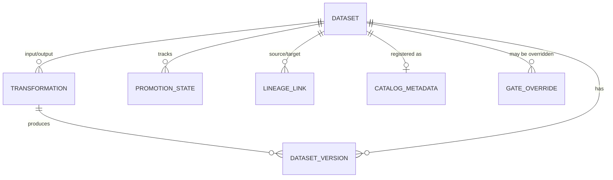

# Phase 1 Data Model: Medallion Architecture Processing

**Feature**: 003-medallion-processing | **Date**: 2026-09-15

Entities derived from the spec's Key Entities, refined with research decisions (see [research.md](./research.md)). Persistence: the same PostgreSQL 15 as feature 001/002/004, via SQLAlchemy 2 + a new Alembic migration (reuses the JSONB variant, enums, and timezone conventions from `db/models.py`).

## Entity Relationship Overview



`GATE_OVERRIDE` is the feature 004 `GateOverride` entity (an override applies to a specific blocked run of a dataset). `QualityGate`/`GateReport` (feature 004) supply the promotion conditions this feature consumes.

---

## Dataset

A logical table/file collection in a layer (spec Key Entity).

| Field | Type | Constraints | Notes |
|---|---|---|---|
| id | UUID | PK | |
| platform_id | UUID | FK → Platform | owning platform |
| name | string(63) | required, `^[a-z][a-z0-9-]{2,62}$` | unique per platform |
| layer | enum(`bronze`,`silver`,`gold`) | required | FR-001 |
| schema_definition | jsonb | required | `{column: {type, nullable}}` |
| owner_identity | string(256) | required | FR-009 |
| steward_identity | string(256) | nullable | FR-014 |
| domain | string(63) | nullable | FR-014 |
| description | text | nullable | FR-014 |
| classification | enum(`public`,`internal`,`confidential`,`restricted`,`highly_restricted`) | required | FR-014 |
| quality_score | float | nullable | from feature 004 (FR-014) |
| refresh_metadata | jsonb | nullable | schedule/freshness (FR-014) |
| created_at / updated_at | timestamptz | auto | |

**Uniqueness**: `(platform_id, name)`.
**Rule**: Gold datasets require `owner_identity`, `description`, `quality_score`, and `refresh_metadata` before reaching CONSUMABLE (FR-009).

---

## Transformation

A version-controlled definition converting input dataset(s) to an output dataset (spec Key Entity).

| Field | Type | Constraints | Notes |
|---|---|---|---|
| id | UUID | PK | |
| name | string(63) | required, unique per platform | |
| version | int | ≥1, unique per name | increments on change (FR-005, FR-017) |
| source_layer | enum(`bronze`,`silver`) | required | FR-005 |
| target_layer | enum(`silver`,`gold`) | required | FR-005 |
| logic_definition | jsonb | required, secret-scanned | declarative definition (transformation-schema.md) |
| logic_hash | string(64) | SHA-256 | idempotency/drift |
| dedup_keys | jsonb | nullable | business keys for dedup (US2-AC3) |
| reconciliation_tolerance | float | nullable | Gold reconciliation tolerance (FR-010) |
| owner_identity | string(256) | required | |
| created_at / updated_at | timestamptz | auto | |

**Uniqueness**: `(name, version)`.
**Rule**: `source_layer` must be one layer below `target_layer` (bronze→silver or silver→gold).

---

## DatasetVersion

An immutable snapshot of a dataset produced by a run (spec Key Entity).

| Field | Type | Constraints | Notes |
|---|---|---|---|
| id | UUID | PK | |
| dataset_id | UUID | FK → Dataset | |
| version | int | ≥1, unique per dataset | increments per run |
| transformation_id | UUID | nullable FK → Transformation | producing transformation (FR-017) |
| input_versions | jsonb | nullable | `{input_dataset: version}` (FR-017) |
| table_ref | string | required | Iceberg table location (R-02) |
| record_count | int | ≥0 | |
| quarantined_count | int | default 0 | FR-017 |
| gate_report_id | UUID | nullable FK → GateReport (feature 004) | gate results (FR-017) |
| created_at | timestamptz | required | |

**Uniqueness**: `(dataset_id, version)`.
**Rule**: writes are atomic per version (Iceberg snapshot commit, FR-012); consumers see either the previous or new version, never a torn mix.

---

## PromotionState

The dataset's position in the state machine (spec Key Entity).

| Field | Type | Constraints | Notes |
|---|---|---|---|
| id | UUID | PK | |
| dataset_id | UUID | FK → Dataset | |
| state | enum(`ingested`,`ingestion_validated`,`bronze`,`bronze_validated`,`silver`,`silver_validated`,`gold`,`gold_validated`,`consumable`,`blocked`) | required | FR-007 |
| gate_report_id | UUID | nullable FK → GateReport | gate results that produced this state (US4-AC3) |
| transitioned_at | timestamptz | required | last transition timestamp (US4-AC3) |
| blocked_reason | text | nullable | set when `blocked` (US4-AC1) |

**State machine** (FR-007, constitution III):

```text
INGESTED → INGESTION_VALIDATED → BRONZE → BRONZE_VALIDATED → SILVER → SILVER_VALIDATED → GOLD → GOLD_VALIDATED → CONSUMABLE
```

**Rule**: a transition occurs only when the relevant quality gate passes (feature 004); a failed gate leaves the dataset `blocked` at the failed layer (US4-AC1). `blocked` is a transient marker, not a state-machine node.

---

## LineageLink

A directed relationship between datasets (or source→dataset) (spec Key Entity).

| Field | Type | Constraints | Notes |
|---|---|---|---|
| id | UUID | PK | |
| source_dataset_id | UUID | FK → Dataset | upstream |
| target_dataset_id | UUID | FK → Dataset | downstream |
| transformation_id | UUID | nullable FK → Transformation | derivation (FR-015) |
| transformation_version | int | nullable | version that produced the link (FR-017) |
| created_at | timestamptz | required | |

**Rule**: lineage is maintained end-to-end source → Bronze → Silver → Gold → consumers, navigable in both directions (FR-015, SC-006).

---

## CatalogMetadata

Catalog registration for a dataset (spec Key Entity).

| Field | Type | Constraints | Notes |
|---|---|---|---|
| id | UUID | PK | |
| dataset_id | UUID | FK → Dataset | |
| catalog_endpoint | string | required | feature 001 catalog endpoint |
| registered_at | timestamptz | required | |
| metadata_json | jsonb | secret-scanned | owner, steward, domain, description, classification, quality score, lineage, refresh (FR-014) |

**Rule**: every dataset is registered in the catalog with complete metadata (FR-014, SC-002).

---

## Cross-entity invariants

1. **No promotion without a passing gate**: a dataset transitions only when the relevant quality gate passes (FR-007); a failed gate leaves it `blocked` (US4-AC1).
2. **Override scoping**: an override applies only to the specific blocked run it was granted for; reprocessing re-evaluates the gate (FR-008, feature 004 FR-012).
3. **Atomic per-version writes**: consumers see either the previous or new version, never a torn mix (FR-012, R-02).
4. **Bronze immutable**: modification/deletion outside an approved retention policy is rejected and recorded (FR-002).
5. **No plaintext secrets** in any of `logic_definition`, `metadata_json`, `blocked_reason` — enforced by the existing secret-scan pass on every write path.
6. **Cloud independence**: identical layer model, transformation definitions, promotion states, and metadata on both clouds (FR-018, SC-007).