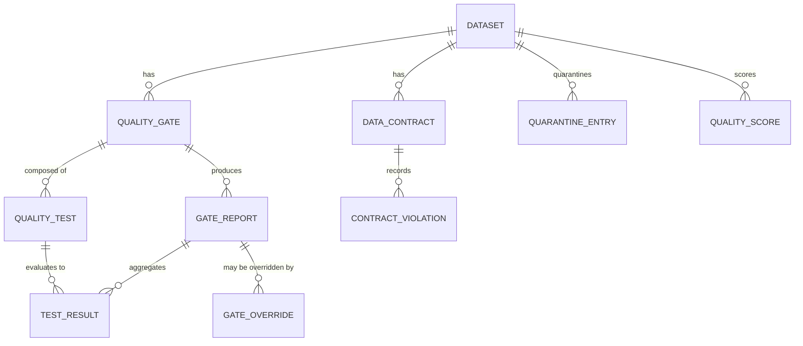

# Phase 1 Data Model: Shift-Left Data Quality Gates

**Feature**: 004-data-quality-gates | **Date**: 2026-09-15

Entities derived from the spec's Key Entities, refined with research decisions (see [research.md](./research.md)). Persistence: the same PostgreSQL 15 as feature 001/002, via SQLAlchemy 2 + a new Alembic migration (reuses the JSONB variant, enums, and timezone conventions from `db/models.py`).

## Entity Relationship Overview

`DATASET` is the feature 003 `Dataset` entity (a gate/contract/quarantine/score belongs to exactly one dataset). The promotion state machine itself is owned by feature 003; this feature supplies the gate decisions that drive it.

---

## QualityGate

The test set bound to a layer transition for a dataset (spec Key Entity).

| Field | Type | Constraints | Notes |
|---|---|---|---|
| id | UUID | PK | |
| dataset_id | UUID | FK → Dataset | |
| transition | enum(`ingestion_to_bronze`,`bronze_to_silver`,`silver_to_gold`,`gold_to_consumable`) | required | FR-001 |
| config_version | int | ≥1, unique per (dataset, transition) | increments on change (FR-013, R-03) |
| config_yaml | text | required, secret-scanned | canonical definition (FR-018) |
| config_hash | string(64) | SHA-256 | idempotency/drift |
| environment_overrides | jsonb | `{env: {test_id: severity}}` | per-environment severity (FR-005) |
| created_by / created_at / updated_at | string / timestamptz / timestamptz | | |

**Uniqueness**: `(dataset_id, transition, config_version)`.
**Rule**: a gate must contain at least one CRITICAL or ERROR test to be deployable (fail-closed guarantee, FR-002).

---

## QualityTest

A single quality rule (spec Key Entity). Category from the 17 standard categories (FR-003).

| Field | Type | Constraints | Notes |
|---|---|---|---|
| id | UUID | PK | |
| gate_id | UUID | FK → QualityGate | |
| name | string(63) | required, unique per gate | |
| category | enum(`schema`,`type`,`nullability`,`uniqueness`,`completeness`,`validity`,`referential_integrity`,`reconciliation`,`freshness`,`volume`,`distribution`,`business_rule`,`security`,`contract`,`transformation`,`statistical`) | required | FR-003 |
| severity | enum(`critical`,`error`,`warning`,`informational`) | required | FR-004 |
| parameters | jsonb | required | thresholds/expressions per category |
| owner_identity | string(256) | required | |
| created_at / updated_at | timestamptz | auto | |

**Severity semantics** (FR-004): CRITICAL/ERROR block by default; WARNING continues with notification; INFORMATIONAL records only. Per-environment override in `QualityGate.environment_overrides` (FR-005).

---

## TestResult

One test's outcome in one run (spec Key Entity).

| Field | Type | Constraints | Notes |
|---|---|---|---|
| id | UUID | PK | |
| test_id | UUID | FK → QualityTest | |
| report_id | UUID | FK → GateReport | |
| status | enum(`passed`,`failed`,`warning`,`error`,`not_run`) | required | `not_run` = could not execute (fail-closed, FR-002) |
| measured_value | jsonb | nullable | e.g. actual staleness, count, distribution |
| failed_record_count | int | default 0 | FR-013 |
| failed_record_refs | jsonb | nullable | identifiers or refs for drill-down (FR-015) |
| duration_ms | int | nullable | |
| ran_at | timestamptz | required | |

**Rule**: `status=not_run` on a CRITICAL/ERROR test forces the gate to BLOCK (R-03, FR-002).

---

## GateReport

The aggregate decision for a run (spec Key Entity).

| Field | Type | Constraints | Notes |
|---|---|---|---|
| id | UUID | PK | |
| gate_id | UUID | FK → QualityGate | |
| dataset_id | UUID | FK → Dataset | |
| run_id | UUID | FK → run (feature 002/003) | the run being gated |
| config_version | int | required | version active when batch started (R-03) |
| decision | enum(`promote`,`block`) | required | FR-001 |
| overall_status | enum(`passed`,`failed`,`warning`,`error`) | required | FR-013 |
| tests_run / tests_passed / tests_warned / tests_failed | int | default 0 | FR-013 |
| quality_score_contribution | float | nullable | feeds QualityScore (FR-014) |
| created_at | timestamptz | required | |

**Rule**: `decision=block` iff any CRITICAL/ERROR test is `failed` or `not_run` (R-03).

---

## DataContract

Schema agreement for a dataset (spec Key Entity). Origin explicit or inferred.

| Field | Type | Constraints | Notes |
|---|---|---|---|
| id | UUID | PK | |
| dataset_id | UUID | FK → Dataset | |
| version | int | ≥1, unique per dataset | increments on change |
| schema_definition | jsonb | required | `{column: {type, nullable}}` |
| origin | enum(`explicit`,`inferred`) | required | FR-006/FR-007 |
| approval_status | enum(`pending`,`approved`,`rejected`) | default `pending` for inferred | never auto-approved (constitution V) |
| created_by / approved_by | string / string | nullable | |
| created_at / updated_at | timestamptz | auto | |

**Rule**: inferred contracts require explicit owner approval before they gate promotion (FR-007, US2-AC3/AC4).

---

## ContractViolation

A detected deviation (spec Key Entity).

| Field | Type | Constraints | Notes |
|---|---|---|---|
| id | UUID | PK | |
| contract_id | UUID | FK → DataContract | |
| batch_id | UUID | FK → batch | affected batch |
| change_description | text | required | e.g. "column `age` type int→string" |
| classification | enum(`breaking`,`non_breaking`,`warning`) | required | FR-006 |
| action_taken | text | required | blocked / allowed+recorded / notified |
| created_at | timestamptz | required | |

**Rule**: `breaking` violations block promotion (FR-006, constitution IV).

---

## QuarantineEntry

A rejected record/file with full failure context (spec Key Entity).

| Field | Type | Constraints | Notes |
|---|---|---|---|
| id | UUID | PK | |
| dataset_id | UUID | FK → Dataset | |
| batch_id | UUID | FK → batch | |
| payload_ref | string | required | object-storage path to quarantined payload |
| failure_reason | text | required | FR-008 |
| failed_test | string | nullable | failed test name (FR-008) |
| attempt_count | int | default 1 | FR-009 |
| replay_eligible | bool | default true | FR-009 |
| retention_expiry | timestamptz | required | FR-010 |
| quarantined_at | timestamptz | required | |
| metadata_json | jsonb | secret-scanned | pipeline id, source, error details (FR-008) |

**Rules**: replay after `retention_expiry` refused explicitly (FR-010); `attempt_count` increments on replay failure, escalates to owner beyond threshold (FR-009); successful replay removes from active queue (US3-AC2).

---

## GateOverride

A granted bypass of a blocked gate (spec Key Entity).

| Field | Type | Constraints | Notes |
|---|---|---|---|
| id | UUID | PK | |
| report_id | UUID | FK → GateReport | the specific blocked run (FR-012) |
| dataset_id | UUID | FK → Dataset | |
| authorising_identity | string(256) | required | FR-011 |
| reason | text | required | FR-011 |
| expiry | timestamptz | required | FR-011 |
| impact_assessment | text | required | FR-011 |
| granted_at | timestamptz | required | FR-011 |
| status | enum(`active`,`expired`,`revoked`) | default `active` | FR-012 |

**Rules**: incomplete override rejected (FR-011); applies only to the granted run (FR-012); expires automatically (FR-012); permanently in audit history (FR-012).

---

## QualityScore

A dataset's current quality measure (spec Key Entity).

| Field | Type | Constraints | Notes |
|---|---|---|---|
| id | UUID | PK | |
| dataset_id | UUID | FK → Dataset | |
| score | float | 0–100 | deterministic formula (R-07) |
| window_start / window_end | timestamptz | required | recent gate-result window |
| computed_at | timestamptz | required | |
| history_json | jsonb | nullable | per-run results for trend (FR-014) |

**Rule**: score computed by a documented, deterministic formula over recent gate results (spec Assumptions, R-07).

---

## Cross-entity invariants

1. **Fail-closed**: a gate with any CRITICAL/ERROR test `failed` or `not_run` is BLOCK; no silent bypass (FR-002, FR-011).
2. **No plaintext secrets** in any of `config_yaml`, `metadata_json`, `failure_reason`, `impact_assessment` — enforced by the existing secret-scan pass on every write path.
3. **Override scoping**: an override applies only to the specific blocked run it was granted for; reprocessing re-evaluates the gate (FR-012, edge case).
4. **Replay idempotency**: replay must not duplicate successfully processed records (FR-009).
5. **Version traceability**: every gate report records the gate config version active when the batch started (FR-013, R-03).
6. **Cloud independence**: identical gate outcomes for identical data and configuration on both clouds (FR-019, SC-008).