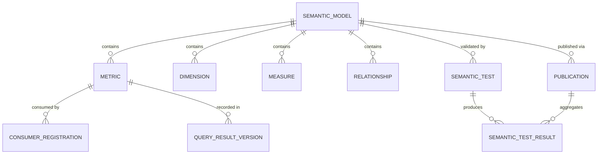

# Phase 1 Data Model: Semantic Layer

**Feature**: 006-semantic-layer | **Date**: 2026-09-15

Entities derived from the spec's Key Entities, refined with research decisions (see [research.md](./research.md)). Persistence: the same PostgreSQL 15 as features 001–005, via SQLAlchemy 2 + a new Alembic migration (reuses the JSONB variant, enums, and timezone conventions from `db/models.py`).

## Entity Relationship Overview

`SEMANTIC_MODEL` is the versioned collection of metrics, dimensions, measures, and relationships for a domain — the unit of publication through GitOps (FR-003). Metrics bind to Gold/Silver `Dataset` entities (feature 003); access policies are enforced from feature 005 (not stored here).

---

## SemanticModel

The versioned collection of semantic definitions for a domain (spec Key Entity, R-03).

| Field | Type | Constraints | Notes |
|---|---|---|---|
| id | UUID | PK | |
| domain | string(63) | required, unique | business-term names unique per domain (FR-009) |
| version | int | ≥1, unique per domain | increments on change (FR-003) |
| config_yaml | text | required, secret-scanned | canonical definition (FR-003) |
| config_hash | string(64) | SHA-256 | idempotency/drift |
| certification_state | enum(`draft`,`published`,`deprecated`) | default `draft` | FR-006 |
| created_by / created_at / updated_at | string / timestamptz / timestamptz | | |

**Uniqueness**: `(domain, version)`.
**Rule**: business-term names unique within a domain; conflicts resolved via domain scoping or governance decision before publication (FR-009).

---

## Metric

A named business measure (spec Key Entity).

| Field | Type | Constraints | Notes |
|---|---|---|---|
| id | UUID | PK | |
| model_id | UUID | FK → SemanticModel | |
| name | string(63) | required, unique per model | business term (FR-009) |
| business_definition | text | required | plain-language definition (FR-006) |
| formula | jsonb | required | measure + aggregation + optional filter (R-02) |
| dimensions | jsonb | required | list of dimension names (FR-006) |
| bound_datasets | jsonb | required | Gold/Silver dataset ids (FR-006) |
| owner_identity | string(256) | required | FR-006 |
| quality_score | float | nullable | from feature 004 (FR-006) |
| freshness | timestamptz | nullable | last refresh (FR-006) |
| successor_metric_id | UUID | nullable | deprecation successor (FR-010) |
| created_at / updated_at | timestamptz | auto | |

**Rule**: a metric's `formula` compiles to a valid DuckDB query over its `bound_datasets` (R-02); a metric over a RESTRICTED dataset is only queryable by authorised roles (FR-007).

---

## Dimension

An axis of analysis (spec Key Entity).

| Field | Type | Constraints | Notes |
|---|---|---|---|
| id | UUID | PK | |
| model_id | UUID | FK → SemanticModel | |
| name | string(63) | required, unique per model | e.g. customer, product, time |
| members | jsonb | required | dimension members |
| relationships | jsonb | nullable | relationships to other dimensions |
| protection_status | enum(`public`,`internal`,`confidential`,`restricted`,`highly_restricted`) | required | from feature 005 (FR-007) |
| created_at / updated_at | timestamptz | auto | |

**Rule**: protected dimension members remain masked/tokenised per policy in semantic query output (FR-007, SC-005).

---

## Measure

A quantitative column within a dataset that metrics aggregate over (spec Key Entity).

| Field | Type | Constraints | Notes |
|---|---|---|---|
| id | UUID | PK | |
| model_id | UUID | FK → SemanticModel | |
| name | string(63) | required, unique per model | |
| dataset_id | UUID | FK → Dataset | source dataset |
| column | string(63) | required | source column |
| data_type | string(63) | required | numeric/string/etc. |
| created_at / updated_at | timestamptz | auto | |

---

## Relationship

A declared join/association between datasets or dimensions used in metric computation (spec Key Entity).

| Field | Type | Constraints | Notes |
|---|---|---|---|
| id | UUID | PK | |
| model_id | UUID | FK → SemanticModel | |
| name | string(63) | required, unique per model | |
| left_dataset_id / right_dataset_id | UUID | FK → Dataset | joined datasets |
| join_key | string(63) | required | join column |
| join_type | enum(`inner`,`left`,`right`,`full`) | required | |
| created_at / updated_at | timestamptz | auto | |

**Rule**: relationships validated for fan-out/double-counting anomalies by semantic tests before publication (FR-004, SC-007).

---

## SemanticTest

A validation bound to a definition (spec Key Entity, R-04).

| Field | Type | Constraints | Notes |
|---|---|---|---|
| id | UUID | PK | |
| model_id | UUID | FK → SemanticModel | |
| name | string(63) | required, unique per model | |
| category | enum(`calculation`,`reconciliation`,`relationship`,`filter`) | required | FR-004 |
| parameters | jsonb | required | reference data, expected values, tolerances |
| created_at / updated_at | timestamptz | auto | |

**Rule**: a failing semantic test blocks publication (FR-004); scheduled tests detect drift on production data (FR-014).

---

## SemanticTestResult

One semantic test's outcome in one run (spec Key Entity).

| Field | Type | Constraints | Notes |
|---|---|---|---|
| id | UUID | PK | |
| test_id | UUID | FK → SemanticTest | |
| publication_id | UUID | FK → Publication | nullable; scheduled runs have none |
| status | enum(`passed`,`failed`,`error`) | required | |
| measured_value | jsonb | nullable | actual vs expected |
| ran_at | timestamptz | required | |
| trigger | enum(`publish`,`schedule`) | required | FR-014 |

---

## Publication

A GitOps publication of a semantic model version (spec Key Entity, R-03).

| Field | Type | Constraints | Notes |
|---|---|---|---|
| id | UUID | PK | |
| model_id | UUID | FK → SemanticModel | |
| version | int | required | published version |
| change_classification | enum(`breaking`,`non_breaking`) | required | FR-005 |
| approval_status | enum(`pending`,`approved`,`rejected`) | default `pending` | breaking requires approval (FR-005) |
| approved_by | string(256) | nullable | |
| published_at | timestamptz | nullable | |
| created_at | timestamptz | required | |

**Rule**: publication requires passing semantic tests (FR-004); breaking changes require explicit approval + consumer notification (FR-005).

---

## ConsumerRegistration

A record of which teams/paths consume which metrics (spec Key Entity, R-08).

| Field | Type | Constraints | Notes |
|---|---|---|---|
| id | UUID | PK | |
| metric_id | UUID | FK → Metric | |
| consumer_identity | string(256) | required | team/path |
| consumption_path | enum(`bi`,`analyst_sql`,`ai_ml`,`application`) | required | FR-002 |
| created_at | timestamptz | required | |

**Rule**: breaking changes and deprecations notify registered consumers (FR-005, FR-010).

---

## QueryResultVersion

The definition version recorded with every query result (spec Key Entity, R-06).

| Field | Type | Constraints | Notes |
|---|---|---|---|
| id | UUID | PK | |
| metric_id | UUID | FK → Metric | |
| model_version | int | required | definition version used (FR-012) |
| dataset_versions | jsonb | required | underlying dataset versions (SC-006) |
| freshness | timestamptz | nullable | underlying data freshness (FR-008) |
| quality_state | enum(`passed`,`failed`,`unknown`) | required | underlying quality state (FR-008) |
| queried_at | timestamptz | required | |

**Rule**: the definition version + dataset versions are recorded with every result, enabling reproducibility of past reports (FR-012, SC-006).