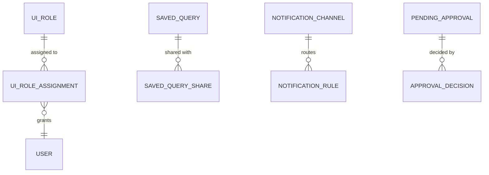

# Phase 1 Data Model: Web UI Control Plane

**Feature**: 007-web-ui-control-plane | **Date**: 2026-09-16

Entities derived from the spec's Key Entities, refined with research decisions (see [research.md](./research.md)). Persistence: the same PostgreSQL 15 as features 001–006, via SQLAlchemy 2 + a new Alembic migration (reuses the JSONB variant, enums, and timezone conventions from `db/models.py`).

The UI stores **only UI-owned metadata** (spec Assumptions). All business data (platforms, runs, datasets, gates, contracts, quarantine, quality, semantic, security) lives in the existing control-plane DB and is read through the existing features 001–006 APIs — it is NOT re-modelled here.

## Entity Relationship Overview

`UI_ROLE` is the RBAC permission set (platform/dataset/column scope, FR-013/FR-014). `SAVED_QUERY` is a user's stored SQL (FR-010). `NOTIFICATION_CHANNEL` is per-platform alert routing (FR-014). `PENDING_APPROVAL` is a read-side aggregation over the existing approval records (contracts, overrides, semantic publications, production changes, FR-016). `AUDIT_TRAIL_ENTRY` is the existing audit service (feature 001) — the UI adds a search router, not a new table.

---

## UIRole

A named permission set scoping views and actions (spec Key Entity, R-08).

| Field | Type | Constraints | Notes |
|---|---|---|---|
| id | UUID | PK | |
| name | string(63) | required, unique | e.g. `platform_admin`, `data_engineer`, `analyst` |
| scope | enum(`platform`,`dataset`,`column`) | required | FR-013/FR-014 |
| permissions | jsonb | required | list of permission keys (view/action) |
| platform_scope | jsonb | nullable | platform ids the role applies to |
| dataset_scope | jsonb | nullable | dataset ids + column restrictions |
| created_by / created_at / updated_at | string / timestamptz / timestamptz | | |

**Rule**: a role's permissions are enforced on the backend for every action (R-08); the frontend hides/disabled denied areas (FR-013) but never trusts the client.

---

## UIRoleAssignment

Binds a user to a role (FR-014).

| Field | Type | Constraints | Notes |
|---|---|---|---|
| id | UUID | PK | |
| role_id | UUID | FK → UIRole | |
| user_identity | string(256) | required | federated identity |
| granted_by / granted_at | string / timestamptz | | audited (FR-015) |

**Rule**: unique `(role_id, user_identity)`.

---

## SavedQuery

A user's stored SQL with metadata (spec Key Entity, R-07).

| Field | Type | Constraints | Notes |
|---|---|---|---|
| id | UUID | PK | |
| name | string(127) | required | |
| owner_identity | string(256) | required | |
| sql_text | text | required, secret-scanned | FR-022 |
| dataset_bindings | jsonb | required | dataset ids the query binds to |
| sharing | enum(`private`,`shared`) | default `private` | US4-AC4 |
| created_at / updated_at | timestamptz | auto | |

**Rule**: execution always re-evaluates the runner's access rights (spec Key Entity); sharing is by reference and the recipient's own access rights apply on open (US4-AC4).

---

## SavedQueryShare

A share grant on a saved query (US4-AC4).

| Field | Type | Constraints | Notes |
|---|---|---|---|
| id | UUID | PK | |
| query_id | UUID | FK → SavedQuery | |
| shared_with_identity | string(256) | required | |
| shared_by / shared_at | string / timestamptz | | audited (FR-015) |

**Rule**: unique `(query_id, shared_with_identity)`.

---

## NotificationChannel

Per-platform alert routing configuration (spec Key Entity, R-08).

| Field | Type | Constraints | Notes |
|---|---|---|---|
| id | UUID | PK | |
| platform_id | UUID | FK → Platform | per-platform (FR-014) |
| channel_type | enum(`email`,`webhook`,`slack`) | required | |
| name | string(63) | required | |
| config | jsonb | required, secret-scanned | recipients/endpoints; never plaintext credentials (FR-022) |
| event_types | jsonb | required | alert event types routed |
| enabled | bool | default true | |
| created_by / created_at / updated_at | string / timestamptz / timestamptz | | |

**Rule**: channel config is secret-scanned on write (FR-022); credentials never displayed in the UI (FR-022, SC-006).

---

## PendingApproval

A read-side aggregation over existing approval records (FR-016, R-04). Not a new business table — a view/router over the existing contracts, overrides, semantic publications, and production-change records.

| Field | Type | Constraints | Notes |
|---|---|---|---|
| id | UUID | PK (derived) | |
| approval_type | enum(`production_change`,`override`,`semantic_publication`,`contract`) | required | FR-016 |
| requester | string(256) | required | |
| payload_ref | string | required | link to the underlying record |
| approvers | jsonb | required | configured approvers |
| decision_state | enum(`pending`,`approved`,`denied`) | default `pending` | |
| reasoning | text | nullable | recorded on decision (FR-016) |
| created_at / decided_at | timestamptz | | |

**Rule**: approve/deny with recorded reasoning (FR-016); all decisions audited (FR-015).

---

## AuditTrailEntry (UI-originated)

The existing audit service (feature 001) — the UI adds a search router, not a new table. UI-originated entries carry actor, timestamp, action, resource, and before/after state (FR-015).

| Field | Type | Constraints | Notes |
|---|---|---|---|
| id | UUID | PK (existing) | |
| actor_identity | string(256) | required | |
| action | string(127) | required | |
| resource | string(255) | required | |
| before_state / after_state | jsonb | nullable | FR-015 |
| created_at | timestamptz | | |

**Rule**: searchable by time, identity, resource, and action (FR-014).